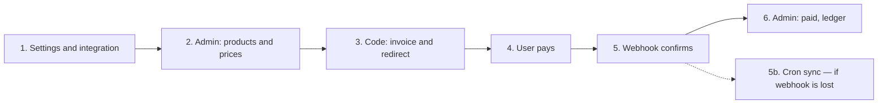

# django-stripe-plisio

Reusable Django package for billing: plan catalog, invoices, balance, promo codes, and two payment providers — **Stripe** (cards, subscriptions) and **Plisio** (crypto invoices).

The package is not tied to a specific project: it is integrated via `INSTALLED_APPS`, settings constants, and `include()` URLs. The link to the user is only through `settings.AUTH_USER_MODEL`.

---

## Table of Contents

- [Business process: from setup to payment](#business-process-from-setup-to-payment)
- [Features](#features)
- [Architecture](#architecture)
- [Package structure](#package-structure)
- [Installation](#installation)
- [Integration in a project](#integration-in-a-project)
- [Configuration](#configuration)
- [Scheduled tasks (cron)](#scheduled-tasks-cron)
- [Data models](#data-models)
- [Service layer](#service-layer)
- [Payment providers](#payment-providers)
- [REST API](#rest-api)
- [Webhooks](#webhooks)
- [Signals](#signals)
- [Django Admin](#django-admin)
- [Common scenarios](#common-scenarios)
- [Invariants and constraints](#invariants-and-constraints)
- [Development and testing](#development-and-testing)

---

## Business process: from setup to payment

Below is the full path of how this works in practice. **First**, the developer integrates the package and configures keys in settings; **then**, the manager fills the catalog in the admin; **finally**, the user pays through your code.



---

### Step 1. Settings and package integration (once, first)

Until variables are configured and the package is integrated, payments will not work. This is done by the **developer**.

#### 1.1. Installation and apps in the project

```bash
pip install django-stripe-plisio[api]
```

```python
# settings.py
INSTALLED_APPS = [
    # ...
    "django_stripe_plisio",
    "django_stripe_plisio.billing",
    "django_stripe_plisio.payments",
]

# urls.py
urlpatterns = [
    path("admin/", admin.site.urls),
    path("billing/", include("django_stripe_plisio.urls")),
]
```

```bash
python manage.py migrate dsp_billing
python manage.py migrate dsp_payments
```

After migrations, **Billing** and **Payments** sections appear in `/admin/`.

#### 1.2. Stripe and Plisio keys

Obtain them from the [Stripe Dashboard](https://dashboard.stripe.com) and [Plisio Dashboard](https://plisio.net), then set them in `settings.py` or `.env`:

```python
# Stripe — cards and subscriptions
DJANGO_STRIPE_PLISIO_STRIPE_SECRET_KEY = "sk_live_..."      # test: sk_test_...
DJANGO_STRIPE_PLISIO_STRIPE_WEBHOOK_SECRET = "whsec_..."    # Stripe → Developers → Webhooks

# Plisio — crypto invoices
DJANGO_STRIPE_PLISIO_PLISIO_API_KEY = "your_api_key"
DJANGO_STRIPE_PLISIO_PLISIO_CALLBACK_SECRET = "secret_from_dashboard"
DJANGO_STRIPE_PLISIO_PLISIO_WEBHOOK_URL = "https://your-site.com/billing/webhooks/plisio/"

# Currencies and redirects after payment
DJANGO_STRIPE_PLISIO_DEFAULT_CURRENCY = "USD"
DJANGO_STRIPE_PLISIO_ALLOWED_CURRENCIES = ["USD", "EUR", "RUB"]
DJANGO_STRIPE_PLISIO_SUCCESS_URL = "https://your-site.com/payment/success"
DJANGO_STRIPE_PLISIO_CANCEL_URL = "https://your-site.com/payment/cancel"

# Security and invoice lifetime
DJANGO_STRIPE_PLISIO_REQUIRE_WEBHOOK_SECRET = True  # always True in prod
DJANGO_STRIPE_PLISIO_INVOICE_PENDING_TTL_HOURS = 24  # optional
DJANGO_STRIPE_PLISIO_USER_ID_FIELD = "pk"  # or your User's uuid field

# Scheduled tasks: status catch-up and pending expiration (optional, see «Scheduled tasks» section)
DJANGO_STRIPE_PLISIO_CRON = {
    "sync_invoices": {
        "enabled": True,
        "schedule": "*/10 * * * *",
    },
    "expire_invoices": {
        "enabled": True,
        "schedule": "0 * * * *",
    },
}
DJANGO_STRIPE_PLISIO_INVOICE_SYNC_BATCH_SIZE = 100
```

| Variable | Purpose |
|------------|-------------|
| `STRIPE_SECRET_KEY` | Creating Checkout Session and polling status in cron |
| `STRIPE_WEBHOOK_SECRET` | Stripe signature verification (required in prod) |
| `PLISIO_API_KEY` | Creating crypto invoice and polling operation in cron |
| `PLISIO_CALLBACK_SECRET` | Plisio `verify_hash` verification |
| `PLISIO_WEBHOOK_URL` | Callback URL for Plisio API (`callback_url`) |
| `SUCCESS_URL` / `CANCEL_URL` | User redirect after Stripe Checkout |
| `REQUIRE_WEBHOOK_SECRET` | Reject webhooks without a secret (fail-closed) |
| `ALLOWED_CURRENCIES` | Allowed currencies in invoices |
| `INVOICE_PENDING_TTL_HOURS` | `expires_at` for pending + `dsp_expire_invoices` |
| `CRON` | Schedule for `dsp_sync_invoices` / `dsp_expire_invoices` |
| `INVOICE_SYNC_BATCH_SIZE` | How many pending invoices to poll per sync run |

> **Important:** `PLISIO_WEBHOOK_URL` is the application endpoint (`/billing/webhooks/plisio/`), not the «thank you for your payment» page.

#### 1.3. Webhooks at providers

The primary channel for payment confirmation is the **webhook**. Without it, the invoice stays **pending** even if the user has already paid.

| Provider | URL in provider dashboard | Event |
|-----------|---------------------------|---------|
| Stripe | `https://your-site.com/billing/webhooks/stripe/` | `checkout.session.completed` |
| Plisio | `https://your-site.com/billing/webhooks/plisio/` | callback on `completed` status |

#### 1.4. Cron (fallback channel)

If a webhook did not arrive (network, downtime, wrong URL), enable periodic **sync** — the `dsp_sync_invoices` command polls the Stripe/Plisio API by `external_id` of pending invoices. Details — [Scheduled tasks (cron)](#scheduled-tasks-cron).

Minimum for prod:

1. Configure webhooks (step 1.3).
2. Enable `DJANGO_STRIPE_PLISIO_CRON` and register tasks (`django-crontab` or system cron).
3. **First** schedule `dsp_sync_invoices`, **then** `dsp_expire_invoices`.

At this step the integration is ready — you can move on to the catalog.

---

### Step 2. Manager fills the catalog in the admin

Once settings are configured, go to `/admin/` and create what you sell.

| Admin section | What to fill in | Why |
|------------------|---------------|--------|
| **Billing → Products** | `code` (e.g. `pro`), name, description, `is_active` | Plan or service in the catalog |
| **Billing → Prices** | product, `currency` (USD/EUR/…), `amount_minor`, period | Price: **999** = 9.99 USD (in cents), not 9.99 in the field |
| **Billing → Promo codes** *(optional)* | code `SAVE10`, percent or fixed | Public discount |
| **Billing → Discount grants** *(optional)* | user, discount type | Personal discount without a promo code |

**Example:** Pro plan = **1999** `amount_minor` + `USD` → the user pays **$19.99**.

For Stripe subscriptions — period `month` or `year`. For one-time payment — `one_time`.

---

### Step 3. Write code: user selects a plan and goes to payment

The user in your application (website, API, dashboard) clicks «Buy». In code:

```python
from django_stripe_plisio import api
from django_stripe_plisio.billing.models import Price

def buy_pro_plan(request):
  # 1) Get the price from the catalog (the one created in the admin)
  price = Price.objects.get(product__code="pro", currency="USD", is_active=True)

  # 2) Issue an invoice to the user
  #    provider="stripe" — card payment
  #    provider="plisio" — crypto payment
  invoice = api.create_invoice(
      user=request.user,
      price=price,
      provider="stripe",
      quantity=1,
      promo_code=request.POST.get("promo"),  # or None
  )

  # 3) Create a payment session at the provider
  attempt = api.create_checkout(invoice)

  # 4) Send the user to the payment page
  return redirect(attempt.payment_url)
```

**What happens internally:**

1. An **Invoice** (status `pending`) and an **InvoiceLine** row with a price snapshot appear in the database.
2. If the promo code is valid — `total_minor` is recalculated, an **InvoiceDiscount** is created.
3. A **PaymentAttempt** and `payment_url` link are created (Stripe Checkout or Plisio invoice).

The same scenario via REST API (if the frontend is Vue/React):

```http
POST /billing/invoices/
{ "price_id": 1, "quantity": 1, "provider": "stripe", "promo_code": "SAVE10" }

POST /billing/payments/stripe/checkout/
{ "invoice_id": 42 }
→ payment_url in the response — redirect the user
```

---

### Step 4. User pays

| Channel | Where they pay | What they see |
|-------|------------|-----------|
| **Stripe** | Stripe Checkout page | Card form; for subscriptions — monthly charge |
| **Plisio** | Plisio page | Address / QR for cryptocurrency transfer |

While the user is paying, the invoice in the admin: **Billing → Invoices** → status **pending**.

---

### Step 5. After payment — what happens automatically

1. Stripe or Plisio sends a **webhook** to your server.
2. The package verifies the signature, saves **WebhookEvent** (no duplicates on retry).
3. The invoice is moved to **paid**, a credit is written to **BalanceLedger**.
4. **UserEntitlement** is created (access to the plan).
5. Signals fire — in your code you can send an email or enable a feature:

```python
from django.dispatch import receiver
from django_stripe_plisio.signals import invoice_paid

@receiver(invoice_paid)
def send_receipt(sender, invoice, **kwargs):
    # your email / notification
    ...
```

---

### Step 6. Where to check the result in the admin

After successful payment, the manager or support checks:

| Admin menu | What to look at |
|----------------|--------------|
| **Billing → Invoices** | Status **paid**, amount, `paid_at`, link to provider |
| **Billing → Balance ledger** | **credit** entry for the invoice amount |
| **Billing → User entitlements** | Granted product access and period |
| **Payments → Payment attempts** | Attempt with **succeeded** status, `payment_url`, errors if any |
| **Payments → Stripe payment attempts** | Stripe payments only |
| **Payments → Plisio payment attempts** | Crypto payments only |
| **Payments → Webhook events** | Raw callbacks, processing status |
| **Payments → Provider transactions** | Reconciliation with provider transaction ID |

**Quick check «did the client pay»:**  
**Billing → Invoices** → filter by user and status **paid**.

**Troubleshooting «money was charged, no access»:**  
**Payments → Webhook events** — is there an event with **processed** status; if **failed** — check `error_message`.

---

### Step 7. Two payment channels — how to choose

| Need | Provider in `create_invoice` | Admin attempts |
|-------|----------------------------|-----------------|
| Card, Apple Pay, subscription | `"stripe"` | Stripe payment attempts |
| Cryptocurrency | `"plisio"` | Plisio payment attempts |

The same product can have multiple **Prices** (USD/EUR) — the user selects the currency on the frontend, you pass the appropriate `price_id`.

---

### Quick role cheat sheet

| Role | Actions | When |
|------|----------|--------|
| **Developer** | Step 1: pip, `INSTALLED_APPS`, migrate, all `DJANGO_STRIPE_PLISIO_*`, webhooks, cron | First |
| **Manager** | Step 2: Products, Prices, Promo codes in the admin | After settings are configured |
| **Developer** | Step 3: `create_invoice` + `create_checkout` code, signals | After the catalog |
| **User** | «Buy» → Stripe/Plisio → return to `SUCCESS_URL` | In production |
| **Support** | Step 6: Invoices (paid?), Payment attempts, Webhook events | After payment |

The rest of the document covers technical details: models, API, architecture.

---

## Features

| Area | What the package does |
|--------|------------------|
| Catalog | Products (`Product`) and prices (`Price`) in minor units + currency |
| Invoices | `Invoice` + `InvoiceLine` rows with a price snapshot at issue time |
| Discounts | Public `PromoCode` and private `DiscountGrant` |
| Payments | Stripe Checkout / Plisio invoice, separate attempts and logs |
| Balance | Append-only `BalanceLedger`, balance calculation per currency |
| Access | `UserEntitlement` after payment (no rigid business logic in the package) |
| Subscriptions | `StripeSubscription` — recurring only through Stripe |
| Audit | `PaymentAttempt`, `WebhookEvent`, `ProviderTransaction` |
| Cron | `dsp_sync_invoices` — poll provider APIs; `dsp_expire_invoices` — TTL pending |
| Scheduling | `DJANGO_STRIPE_PLISIO_CRON` + `build_cronjobs()` for django-crontab |

---

## Architecture


**Payment flow (simplified):**

1. An `Invoice` is created (with optional discount).
2. `create_checkout()` creates a `PaymentAttempt` and a session at the provider (Stripe / Plisio).
3. The user pays on the provider side.
4. Webhook arrives at `/billing/webhooks/...` → idempotent processing → `mark_invoice_paid()`.
5. *(optional)* Cron `dsp_sync_invoices` catches up payment if the webhook was lost.
6. `BalanceLedger` is recorded, `UserEntitlement` if needed, `invoice_paid` signal is sent.
7. *(optional)* Cron `dsp_expire_invoices` moves overdue pending to `expired` by `expires_at`.

---

## Package structure

```
src/django_stripe_plisio/
├── __init__.py          # package version
├── apps.py              # root AppConfig, signals connected on ready()
├── conf.py              # reading DJANGO_STRIPE_PLISIO_* from settings
├── cron.py              # build_cronjobs() for django-crontab
├── signals.py           # invoice_paid, payment_failed, balance_changed, entitlement_granted
├── api.py               # public Python API (re-export of services)
├── urls.py              # root URLs: API (if DRF installed) + webhooks
│
├── billing/             # billing domain (app label: dsp_billing)
│   ├── models.py        # Product, Price, Invoice, discounts, ledger, entitlements
│   ├── enums.py         # statuses, providers, discount and ledger types
│   ├── services.py      # create_invoice, discounts, ledger, mark_invoice_paid, expire_pending_invoices
│   ├── management/commands/
│   │   ├── dsp_expire_invoices.py
│   │   └── dsp_sync_invoices.py
│   ├── admin.py         # billing admin
│   └── migrations/
│
├── payments/            # payments and webhooks (app label: dsp_payments)
│   ├── models.py        # PaymentAttempt, WebhookEvent, ProviderTransaction, StripeSubscription
│   ├── enums.py         # attempt, webhook, subscription statuses
│   ├── services/
│   │   ├── base.py      # abstract BasePaymentProvider
│   │   ├── stripe_service.py
│   │   ├── plisio_service.py
│   │   └── invoice_sync.py   # sync_pending_invoices()
│   ├── sync_types.py    # InvoiceSyncOutcome, SyncResult
│   ├── views/webhooks.py
│   ├── urls_webhooks.py
│   ├── admin.py
│   └── migrations/
│
└── api/                 # REST API (requires extra [api])
    ├── serializers.py
    ├── views.py
    └── urls.py

demo_project/            # integration example and pytest environment
tests/                   # package tests
```

### Key module responsibilities

| File | Responsibility |
|------|-----------------|
| `conf.py` | Single access point for settings (`PackageSettings`): API keys, currencies, cron, sync |
| `cron.py` | `build_cronjobs()` — building `CRONJOBS` for django-crontab |
| `billing/services.py` | Invoice business logic, discount calculation, ledger, moving invoice to `paid` |
| `payments/services/` | Stripe and Plisio integration: checkout, webhook verify, event handling |
| `payments/views/webhooks.py` | HTTP endpoints without CSRF for provider callbacks |
| `api.py` | Stable public API for consumer code imports |
| `api/*` | DRF views/serializers; not loaded if DRF is not installed |

---

## Installation

```bash
# Minimum: models, admin, services, webhooks
pip install django-stripe-plisio

# With REST API
pip install django-stripe-plisio[api]

# With django-crontab (schedule from DJANGO_STRIPE_PLISIO_CRON)
pip install django-stripe-plisio[cron]

# API + cron
pip install django-stripe-plisio[api,cron]

# For development
pip install -e ".[dev]"
```

**Dependencies:**

- `Django>=5.0`
- `stripe` — Stripe API
- `requests` — Plisio HTTP API
- `djangorestframework` — only with extra `[api]`
- `django-crontab` — only with extra `[cron]`

---

## Integration in a project

### 1. `INSTALLED_APPS`

```python
INSTALLED_APPS = [
    # ...
    "django_stripe_plisio",
    "django_stripe_plisio.billing",
    "django_stripe_plisio.payments",
]
```

### 2. Migrations

```bash
python manage.py migrate dsp_billing
python manage.py migrate dsp_payments
```

### 3. URL

```python
from django.urls import include, path

urlpatterns = [
    path("billing/", include("django_stripe_plisio.urls")),
]
```

After integration:

| Path | Purpose |
|------|------------|
| `/billing/products/` | Product list (DRF) |
| `/billing/prices/` | Price list |
| `/billing/invoices/` | Invoice list / creation |
| `/billing/invoices/<id>/` | Invoice details |
| `/billing/payments/stripe/checkout/` | Stripe Checkout Session |
| `/billing/payments/plisio/invoice/` | Plisio crypto invoice |
| `/billing/balance/ledger/` | User balance ledger entries |
| `/billing/webhooks/stripe/` | Stripe webhook |
| `/billing/webhooks/plisio/` | Plisio callback |

> REST routes are available only when `djangorestframework` is installed.

### 4. User

The package does **not** create its own `User` model. It uses `settings.AUTH_USER_MODEL` from your project.

---

## Configuration

All constants are read with the `DJANGO_STRIPE_PLISIO_` prefix (see `conf.py` → `PackageSettings`).

| Constant | Required | Description |
|-----------|----------------|----------|
| `DJANGO_STRIPE_PLISIO_STRIPE_SECRET_KEY` | for Stripe | Secret key (`sk_...`) |
| `DJANGO_STRIPE_PLISIO_STRIPE_WEBHOOK_SECRET` | for Stripe webhooks | Signing secret (`whsec_...`) |
| `DJANGO_STRIPE_PLISIO_PLISIO_API_KEY` | for Plisio | Plisio API key |
| `DJANGO_STRIPE_PLISIO_PLISIO_CALLBACK_SECRET` | for Plisio | Secret for `verify_hash` check in callback |
| `DJANGO_STRIPE_PLISIO_DEFAULT_CURRENCY` | recommended | Default currency, e.g. `"USD"` |
| `DJANGO_STRIPE_PLISIO_ALLOWED_CURRENCIES` | recommended | List of allowed currencies, e.g. `["USD", "EUR", "RUB"]` |
| `DJANGO_STRIPE_PLISIO_SUCCESS_URL` | for checkout | URL after successful payment |
| `DJANGO_STRIPE_PLISIO_CANCEL_URL` | for checkout | URL on cancellation |
| `DJANGO_STRIPE_PLISIO_USER_ID_FIELD` | optional | User field for metadata (default `"pk"`) |
| `DJANGO_STRIPE_PLISIO_INVOICE_PENDING_TTL_HOURS` | optional | Pending invoice TTL → `expires_at` |
| `DJANGO_STRIPE_PLISIO_CRON` | for cron | Schedule for `sync_invoices` / `expire_invoices` tasks |
| `DJANGO_STRIPE_PLISIO_INVOICE_SYNC_BATCH_SIZE` | optional | Invoice limit per sync run (default `100`) |
| `DJANGO_STRIPE_PLISIO_INVOICE_SYNC_PROVIDERS` | optional | `["stripe", "plisio"]` or all if not set |

Example:

```python
DJANGO_STRIPE_PLISIO_STRIPE_SECRET_KEY = env("STRIPE_SECRET_KEY")
DJANGO_STRIPE_PLISIO_STRIPE_WEBHOOK_SECRET = env("STRIPE_WEBHOOK_SECRET")
DJANGO_STRIPE_PLISIO_PLISIO_API_KEY = env("PLISIO_API_KEY")
DJANGO_STRIPE_PLISIO_PLISIO_CALLBACK_SECRET = env("PLISIO_CALLBACK_SECRET")
DJANGO_STRIPE_PLISIO_DEFAULT_CURRENCY = "USD"
DJANGO_STRIPE_PLISIO_ALLOWED_CURRENCIES = ["USD", "EUR", "RUB"]
DJANGO_STRIPE_PLISIO_SUCCESS_URL = "https://example.com/billing/success"
DJANGO_STRIPE_PLISIO_CANCEL_URL = "https://example.com/billing/cancel"
```

---

## Scheduled tasks (cron)

Webhooks are the primary way to learn about payment. **Cron** is a fallback: polling the provider API and local expiration of pending by TTL.


### Management commands

| Command | Purpose |
|---------|------------|
| `python manage.py dsp_sync_invoices` | API polling: pending invoices with non-empty `external_id` |
| `python manage.py dsp_expire_invoices` | Without API: `pending` + `expires_at < now` → `expired` |

**Order is mandatory:** **sync** first, then **expire**. Otherwise an invoice paid with a delay may become `expired` by TTL before sync sees the payment at the provider.

#### `dsp_sync_invoices`

- Reads `DJANGO_STRIPE_PLISIO_CRON["sync_invoices"]["enabled"]`. If `False` — warning to stdout and **exit 0** (cron does not fail).
- Options: `--dry-run` (no DB writes), `--batch-size N` (overrides `INVOICE_SYNC_BATCH_SIZE`).
- At the end prints a summary: `checked`, `paid`, `expired`, `cancelled`, `skipped`, `errors`.

Example output:

```text
Sync done: checked=12 paid=2 expired=1 cancelled=0 skipped=0 errors=0
```

#### `dsp_expire_invoices`

- Does not contact Stripe/Plisio.
- Requires `INVOICE_PENDING_TTL_HOURS` when creating an invoice (the `expires_at` field).

### What sync does per provider

Only invoices with `status=pending` and non-empty `external_id` are processed. Idempotency — via `mark_invoice_paid` and unique `ProviderTransaction` (same as webhook).

| Provider | API | «Paid» condition | Terminal without payment |
|-----------|-----|--------------------|---------------------|
| **Stripe** | `checkout.Session.retrieve(external_id)` | `payment_status=paid` and `status=complete` | — (stays pending) |
| **Plisio** | `GET /api/v1/operations/{txn_id}` | `completed`, `confirmed` | `expired` → invoice `expired`; `cancelled` → `cancelled` |
| **Plisio** | — | `mismatch` | **not** marked paid (log only, `skipped`) |

Limitation: sync does **not** poll Stripe subscriptions (`StripeSubscription`) — only invoice checkout sessions.

### Settings

| Constant | Default | Description |
|-----------|--------------|----------|
| `DJANGO_STRIPE_PLISIO_CRON` | `{}` | Task dictionary: `sync_invoices`, `expire_invoices` |
| `…CRON["sync_invoices"]["enabled"]` | `False` | Enable `dsp_sync_invoices` |
| `…CRON["sync_invoices"]["schedule"]` | — | Cron expression (5 fields, django-crontab) |
| `…CRON["expire_invoices"]["enabled"]` | `False` | Enable `dsp_expire_invoices` |
| `…CRON["expire_invoices"]["schedule"]` | — | Cron expression |
| `DJANGO_STRIPE_PLISIO_INVOICE_SYNC_BATCH_SIZE` | `100` | Invoice limit per run |
| `DJANGO_STRIPE_PLISIO_INVOICE_SYNC_PROVIDERS` | all | E.g. `["stripe"]` or `["plisio"]` |

Example `settings.py`:

```python
DJANGO_STRIPE_PLISIO_CRON = {
    "sync_invoices": {
        "enabled": True,
        "schedule": "*/10 * * * *",  # every 10 minutes
    },
    "expire_invoices": {
        "enabled": True,
        "schedule": "5 * * * *",  # at :05 each hour — after sync
    },
}
DJANGO_STRIPE_PLISIO_INVOICE_SYNC_BATCH_SIZE = 100
DJANGO_STRIPE_PLISIO_INVOICE_PENDING_TTL_HOURS = 24
```

Reading in code: `PackageSettings.cron_config()`, `cron_task_enabled()`, `cron_task_schedule()`.

### Programmatic invocation (without management command)

```python
from django_stripe_plisio.payments.services.invoice_sync import sync_pending_invoices

result = sync_pending_invoices(batch_size=50, dry_run=False)
# result.checked, result.paid, result.expired_remote, ...
```

TTL expiration:

```python
from django_stripe_plisio.billing.services import expire_pending_invoices

expire_pending_invoices()  # -> int, number of updated invoices
```

### django-crontab (recommended)

```bash
pip install "django-stripe-plisio[cron]"
```

```python
# settings.py
INSTALLED_APPS = [
    # ...
    "django_crontab",
    "django_stripe_plisio.billing",
    "django_stripe_plisio.payments",
]

from django_stripe_plisio.cron import build_cronjobs

# Only package tasks with enabled=True and non-empty schedule
CRONJOBS = build_cronjobs()

# Your project tasks — as second argument:
# CRONJOBS = build_cronjobs(extra=[
#     ("0 3 * * *", "myapp.tasks.cleanup"),
# ])
```

Deploy schedule to the server:

```bash
python manage.py crontab add
python manage.py crontab show
python manage.py crontab remove   # when CRONJOBS changes — remove, then add
```

`build_cronjobs()` builds tuples:

```python
("*/10 * * * *", "django.core.management.call_command", ["dsp_sync_invoices"])
```

The package does **not** override `CRONJOBS` in `AppConfig.ready()` — calling `build_cronjobs()` in settings is explicit and predictable.

### system cron / Kubernetes

Without `django-crontab`:

```cron
# /etc/cron.d/billing — order: sync, then expire
*/10 * * * * www-data cd /app && python manage.py dsp_sync_invoices >> /var/log/dsp_sync.log 2>&1
5 * * * * www-data cd /app && python manage.py dsp_expire_invoices >> /var/log/dsp_expire.log 2>&1
```

Kubernetes CronJob — two Jobs with different `schedule`; sync has a more frequent interval, expire — with a small offset after sync.

### When to enable sync in prod

| Situation | Recommendation |
|----------|--------------|
| Webhooks configured and stable | Sync as backup every 5–15 min |
| Plisio/Stripe behind NAT, no public URL | Sync required until webhook is available |
| High load, many pending | Reduce `INVOICE_SYNC_BATCH_SIZE`, run cron more often |
| Test environment only | `enabled: False` or `--dry-run` |

---

## Data models

### Billing (`django_stripe_plisio.billing`)

#### `Product`

Business product or pricing plan.

| Field | Description |
|------|----------|
| `code` | Unique slug (identifier in code) |
| `name`, `description` | Display name and description |
| `is_active` | Available for sale |
| `metadata` | Arbitrary JSON for your logic |

#### `Price`

Product price. **Amounts only in minor units** (cents, kopecks) + `currency`.

| Field | Description |
|------|----------|
| `product` | FK to `Product` |
| `amount_minor` | Amount in minor units |
| `currency` | ISO 4217 (`USD`, `EUR`, …) |
| `billing_period` | `one_time` \| `month` \| `year` |
| `stripe_product_id`, `stripe_price_id` | Stripe object references (optional) |

#### `Invoice`

Invoice to a user.

| Field | Description |
|------|----------|
| `user` | FK to `AUTH_USER_MODEL` |
| `status` | `draft`, `pending`, `paid`, `expired`, `cancelled`, `failed` |
| `provider` | `stripe` or `plisio` — payment channel for the invoice |
| `subtotal_minor`, `discount_minor`, `total_minor` | Amounts before/after discount |
| `payment_url` | Payment link at the provider |
| `external_id` | Session/transaction ID at the provider |
| `paid_at`, `expires_at` | Payment time / expiration |
| `metadata` | Your data (order id, source, …) |

#### `InvoiceLine`

Invoice line — **snapshot** of the price at issue time (changing `Price` does not affect old invoices).

#### `PromoCode`

Public promo code: percent or fixed discount, usage limits, validity period.

#### `DiscountGrant`

Private discount for a specific user (no code). Can be applied automatically on `create_invoice(..., use_private_grant=True)`.

#### `InvoiceDiscount`

Snapshot of the applied discount on the invoice (link to `PromoCode` or `DiscountGrant`).

#### `BalanceLedger`

Append-only balance journal. Types: `credit`, `debit`, `refund`, `adjustment`, `promo`.  
**Entries are not edited** — corrections only via a new ledger entry.

#### `UserEntitlement`

Granted access (period `active_from` / `active_until`). Created after payment; your logic can listen to the `entitlement_granted` signal.

---

### Payments (`django_stripe_plisio.payments`)

#### `PaymentAttempt`

Each payment attempt: provider request/response, status, errors.  
Proxy models for admin: `StripePaymentAttempt`, `PlisioPaymentAttempt` (filter by `provider`).

| Status | Meaning |
|--------|----------|
| `created` | Record created |
| `pending` | Session/invoice created at provider |
| `succeeded` | Success (confirmed by webhook) |
| `failed` | API error |
| `cancelled` | Cancelled |

#### `WebhookEvent`

Raw webhook with a **unique** `idempotency_key`. Redelivery does not duplicate crediting.

#### `ProviderTransaction`

Normalized provider transaction for reconciliation and reporting. Uniqueness: `(provider, external_id)`.

#### `StripeSubscription`

Stripe recurring subscription (cards only). Plisio does **not** emulate auto-charge — only one-time crypto invoices.

---

## Service layer

### Public Python API (`django_stripe_plisio.api`)

```python
from django_stripe_plisio import api

# Create invoice
invoice = api.create_invoice(
    user=request.user,
    price=price,
    provider="stripe",       # or "plisio"
    quantity=1,
    promo_code="SAVE10",     # optional
    metadata={"order_id": "42"},
)

# Create checkout at the invoice provider
attempt = api.create_checkout(invoice)
# attempt.payment_url — link for user redirect

# Apply promo code to pending invoice
invoice = api.apply_promo(invoice, "SAVE10")

# Private discount
api.grant_private_discount(
    user,
    discount_type="percent",
    percent_value=15,
    note="VIP",
)

# Balance and manual ledger entries
balance = api.get_user_balance(user, "USD")
api.record_ledger_entry(
    user,
    entry_type="debit",
    amount_minor=-500,
    currency="USD",
    note="Service charge",
)

# Manually mark as paid (usually called from webhook)
api.mark_invoice_paid(invoice, external_id="cs_...")
```

### `billing/services.py` (internal functions)

| Function | Purpose |
|---------|------------|
| `create_invoice` | Invoice + lines + discount + `total_minor` recalculation |
| `apply_promo` | Promo code on existing pending invoice |
| `calculate_discount_minor` | Discount calculation (percent / fixed) |
| `grant_private_discount` | Create `DiscountGrant` |
| `get_user_balance` | `Sum(amount_minor)` over ledger |
| `record_ledger_entry` | New ledger entry + `balance_changed` signal |
| `mark_invoice_paid` | Status `paid`, credit in ledger, entitlement, `invoice_paid` |
| `expire_pending_invoices` | `pending` + expired `expires_at` → `expired` |

Provider sync: `payments.services.invoice_sync.sync_pending_invoices()`.

---

## Payment providers

Common interface: `BasePaymentProvider` (`create_checkout`, `verify_webhook`, `handle_webhook_event`, `sync_invoice_status`).

Factory: `payments.services.get_payment_service(provider)` / `create_checkout(invoice)`.

### Stripe (`StripePaymentService`)

- Creates **Checkout Session** (`stripe.checkout.Session.create`).
- Mode `payment` for `one_time`, `subscription` for `month` / `year`.
- If `Price` has `stripe_price_id`, the existing Stripe price is used.
- Webhook: `checkout.session.completed` → `mark_invoice_paid`.
- Cron: `sync_invoice_status()` → `Session.retrieve` → same logic as webhook (`_apply_checkout_session_paid`).

**Webhook setup in Stripe Dashboard:**

- URL: `https://your-domain/billing/webhooks/stripe/`
- Event: `checkout.session.completed`
- Secret → `DJANGO_STRIPE_PLISIO_STRIPE_WEBHOOK_SECRET`

### Plisio (`PlisioPaymentService`)

- Creates crypto invoice via `GET https://api.plisio.net/api/v1/invoices/new`.
- Callback verified via `verify_hash` (SHA1 of sorted query + secret).
- Statuses `completed` / `confirmed` → payment counted.
- Cron: `GET /operations/{txn_id}`; `mismatch` does not move invoice to `paid`.

**Callback URL in Plisio dashboard:**

- `https://your-domain/billing/webhooks/plisio/`

---

## REST API

Requires `pip install django-stripe-plisio[api]` and DRF authentication (in demo — `SessionAuthentication`).

### Catalog

```http
GET /billing/products/
GET /billing/prices/
```

### Invoices

```http
GET  /billing/invoices/
POST /billing/invoices/
GET  /billing/invoices/{id}/
```

**POST body:**

```json
{
  "price_id": 1,
  "quantity": 1,
  "provider": "stripe",
  "promo_code": "SAVE10"
}
```

User — from `request.user`; other users' invoices are not visible.

### Payment

```http
POST /billing/payments/stripe/checkout/
POST /billing/payments/plisio/invoice/
```

**Body:** `{ "invoice_id": 123 }` — provider must match `invoice.provider`.

### Balance

```http
GET /billing/balance/ledger/?currency=USD
```

---

## Webhooks

| Endpoint | Provider | CSRF |
|----------|-----------|------|
| `POST /billing/webhooks/stripe/` | Stripe | disabled |
| `POST /billing/webhooks/plisio/` | Plisio | disabled |

**Idempotency:** keys like `stripe:{event_id}` and `plisio:{txn_id}:{status}`. Retry does not cause duplicate balance crediting.

**Fallback:** periodic `dsp_sync_invoices` uses the same `mark_invoice_paid` / status updates — repeated sync is safe.

---

## Signals

Connected in the package's `AppConfig.ready()`. Import: `django_stripe_plisio.signals`.

```python
from django.dispatch import receiver
from django_stripe_plisio.signals import invoice_paid, entitlement_granted

@receiver(invoice_paid)
def on_invoice_paid(sender, invoice, **kwargs):
  # your logic: email, feature activation, CRM, …
  ...

@receiver(entitlement_granted)
def on_entitlement(sender, entitlement, invoice, **kwargs):
  ...
```

| Signal | When |
|--------|-------|
| `invoice_paid` | Invoice moved to `paid` |
| `payment_failed` | Checkout creation error |
| `balance_changed` | New entry in `BalanceLedger` |
| `entitlement_granted` | `UserEntitlement` created |

---

## Django Admin

All main models are registered.

- **Invoice** — inline lines and discounts, filters by `provider`, `status`, `currency`.
- **PaymentAttempt** — general list + separate proxy **Stripe** / **Plisio**.
- **BalanceLedger** — read-only (no edit/delete).
- **WebhookEvent** — readonly `payload` for audit.

---

## Common scenarios

### One-time plan payment (Stripe)

```python
price = Price.objects.get(product__code="pro", currency="USD")
invoice = api.create_invoice(user, price, provider="stripe")
attempt = api.create_checkout(invoice)
return redirect(attempt.payment_url)
```

### Balance top-up with crypto (Plisio)

```python
invoice = api.create_invoice(user, price, provider="plisio")
attempt = api.create_checkout(invoice)
# UI shows attempt.payment_url or QR from Plisio response
```

### Promo code + private discount

- Promo code: `create_invoice(..., promo_code="WELCOME")`.
- Private: `grant_private_discount(user, ...)` — applied automatically if no promo code is passed.

### Stripe subscription

Create a `Price` with `billing_period=month` (or `year`) and on checkout Stripe opens subscription mode. State is stored in `StripeSubscription` (webhook updates can be extended in your project).

### Cron: webhooks + status catch-up

```python
# settings.py — see «Scheduled tasks» section
DJANGO_STRIPE_PLISIO_CRON = {
    "sync_invoices": {"enabled": True, "schedule": "*/10 * * * *"},
    "expire_invoices": {"enabled": True, "schedule": "15 * * * *"},
}
```

```bash
pip install "django-stripe-plisio[cron]"
# settings: CRONJOBS = build_cronjobs()
python manage.py crontab add
```

Manual check:

```bash
python manage.py dsp_sync_invoices --dry-run
python manage.py dsp_sync_invoices
python manage.py dsp_expire_invoices
```

---

## Invariants and constraints

1. **Money** — only `amount_minor` + `currency`, no `float`.
2. **Ledger** — append-only; corrections via a new entry.
3. **Invoice** — price snapshot in `InvoiceLine`; discount in `InvoiceDiscount`.
4. **Webhooks** — idempotent; `mark_invoice_paid` safe on retry.
5. **Plisio** — one-time invoices only, no recurring.
6. **DRF** — optional; without it models, admin, services, webhooks work.
7. **Cron** — `dsp_sync_invoices` before `dsp_expire_invoices`; sync does not cancel sessions at providers.
8. **Business logic** — minimal in the package; extend via signals and your handlers.

---

## Development and testing

### Demo project

```bash
pip install -e ".[dev]"
cd demo_project
python manage.py migrate
python manage.py runserver
```

PyCharm run configurations available: **Demo: runserver**, **Demo: migrate**, **Tests: pytest**.

### Tests

```bash
pytest tests/ -v
ruff check src tests
mypy src/django_stripe_plisio
python -m build
```

### Repository structure

```
django-stripe-plisio/
├── src/django_stripe_plisio/   # package source
├── demo_project/               # integration example
├── tests/                      # pytest
├── pyproject.toml
└── README.md
```

---

## License

MIT
