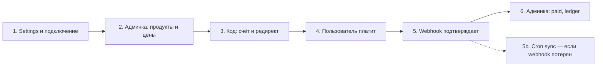
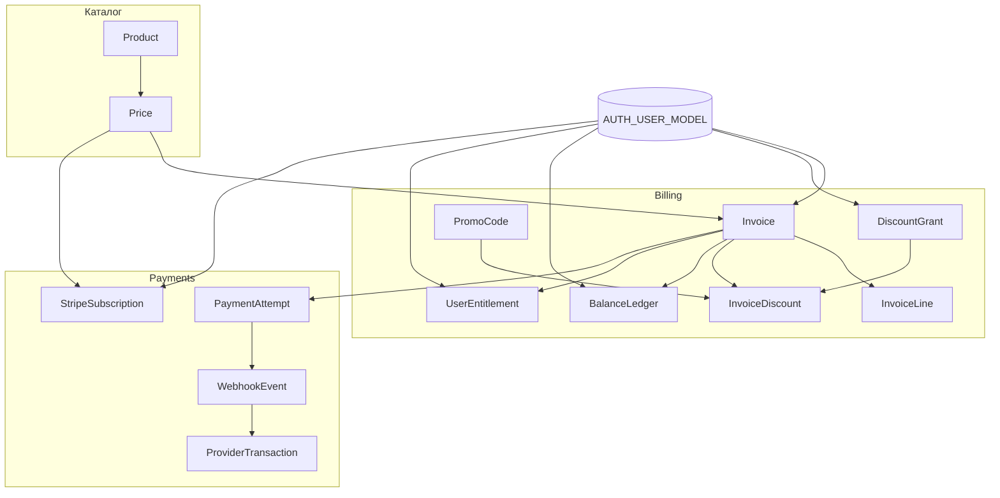
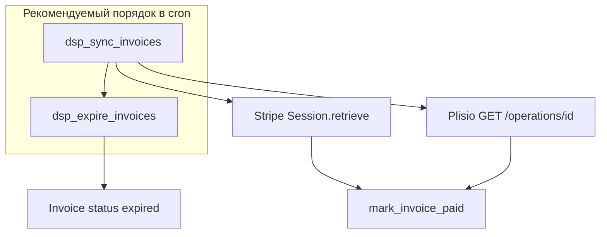

# django-stripe-plisio

Reusable Django-пакет для биллинга: каталог тарифов, счета, баланс, промокоды и два платёжных провайдера — **Stripe** (карты, подписки) и **Plisio** (крипто-инвойсы).

Пакет не привязан к конкретному проекту: подключается через `INSTALLED_APPS`, settings-константы и `include()` URL. Связь с пользователем — только через `settings.AUTH_USER_MODEL`.

---

## Содержание

- [Бизнес-процесс: от настройки до оплаты](#бизнес-процесс-от-настройки-до-оплаты)
- [Возможности](#возможности)
- [Архитектура](#архитектура)
- [Структура пакета](#структура-пакета)
- [Установка](#установка)
- [Подключение в проект](#подключение-в-проект)
- [Настройки](#настройки)
- [Периодические задачи (cron)](#периодические-задачи-cron)
- [Модели данных](#модели-данных)
- [Сервисный слой](#сервисный-слой)
- [Платёжные провайдеры](#платёжные-провайдеры)
- [REST API](#rest-api)
- [Webhooks](#webhooks)
- [Сигналы](#сигналы)
- [Django Admin](#django-admin)
- [Типовые сценарии](#типовые-сценарии)
- [Инварианты и ограничения](#инварианты-и-ограничения)
- [Разработка и тесты](#разработка-и-тесты)

---

## Бизнес-процесс: от настройки до оплаты

Ниже — полный путь «как это работает в жизни». **Сначала** разработчик подключает пакет и прописывает ключи в settings, **потом** менеджер наполняет каталог в админке, **затем** пользователь платит через ваш код.



---

### Шаг 1. Settings и подключение пакета (один раз, в первую очередь)

Пока не настроены переменные и не подключён пакет — оплаты работать не будут. Делает **разработчик**.

#### 1.1. Установка и приложения в проекте

```bash
pip install django-stripe-plisio[api]
```

```python
# settings.py
INSTALLED_APPS = [
    # ...
    "django_stripe_plisio",
    "django_stripe_plisio.billing",
    "django_stripe_plisio.payments",
]

# urls.py
urlpatterns = [
    path("admin/", admin.site.urls),
    path("billing/", include("django_stripe_plisio.urls")),
]
```

```bash
python manage.py migrate dsp_billing
python manage.py migrate dsp_payments
```

После миграций в `/admin/` появятся разделы **Billing** и **Payments**.

#### 1.2. Ключи Stripe и Plisio

Берём в [кабинете Stripe](https://dashboard.stripe.com) и [кабинете Plisio](https://plisio.net), прописываем в `settings.py` или `.env`:

```python
# Stripe — карты и подписки
DJANGO_STRIPE_PLISIO_STRIPE_SECRET_KEY = "sk_live_..."      # тест: sk_test_...
DJANGO_STRIPE_PLISIO_STRIPE_WEBHOOK_SECRET = "whsec_..."    # Stripe → Developers → Webhooks

# Plisio — крипто-инвойсы
DJANGO_STRIPE_PLISIO_PLISIO_API_KEY = "ваш_api_key"
DJANGO_STRIPE_PLISIO_PLISIO_CALLBACK_SECRET = "секрет_из_кабинета"
DJANGO_STRIPE_PLISIO_PLISIO_WEBHOOK_URL = "https://ваш-сайт.com/billing/webhooks/plisio/"

# Валюты и редиректы после оплаты
DJANGO_STRIPE_PLISIO_DEFAULT_CURRENCY = "USD"
DJANGO_STRIPE_PLISIO_ALLOWED_CURRENCIES = ["USD", "EUR", "RUB"]
DJANGO_STRIPE_PLISIO_SUCCESS_URL = "https://ваш-сайт.com/payment/success"
DJANGO_STRIPE_PLISIO_CANCEL_URL = "https://ваш-сайт.com/payment/cancel"

# Безопасность и срок жизни счёта
DJANGO_STRIPE_PLISIO_REQUIRE_WEBHOOK_SECRET = True  # в prod всегда True
DJANGO_STRIPE_PLISIO_INVOICE_PENDING_TTL_HOURS = 24  # опционально
DJANGO_STRIPE_PLISIO_USER_ID_FIELD = "pk"  # или uuid-поле вашего User

# Периодика: догонка статусов и истечение pending (опционально, см. раздел «Периодические задачи»)
DJANGO_STRIPE_PLISIO_CRON = {
    "sync_invoices": {
        "enabled": True,
        "schedule": "*/10 * * * *",
    },
    "expire_invoices": {
        "enabled": True,
        "schedule": "0 * * * *",
    },
}
DJANGO_STRIPE_PLISIO_INVOICE_SYNC_BATCH_SIZE = 100
```

| Переменная | Зачем нужна |
|------------|-------------|
| `STRIPE_SECRET_KEY` | Создание Checkout Session и опрос статуса в cron |
| `STRIPE_WEBHOOK_SECRET` | Проверка подписи Stripe (обязательно в prod) |
| `PLISIO_API_KEY` | Создание crypto invoice и опрос operation в cron |
| `PLISIO_CALLBACK_SECRET` | Проверка `verify_hash` Plisio |
| `PLISIO_WEBHOOK_URL` | URL callback для Plisio API (`callback_url`) |
| `SUCCESS_URL` / `CANCEL_URL` | Редирект пользователя после Stripe Checkout |
| `REQUIRE_WEBHOOK_SECRET` | Отклонять webhook без секрета (fail-closed) |
| `ALLOWED_CURRENCIES` | Разрешённые валюты в счетах |
| `INVOICE_PENDING_TTL_HOURS` | `expires_at` для pending + `dsp_expire_invoices` |
| `CRON` | Расписание `dsp_sync_invoices` / `dsp_expire_invoices` |
| `INVOICE_SYNC_BATCH_SIZE` | Сколько pending-счетов опрашивать за один прогон sync |

> **Важно:** `PLISIO_WEBHOOK_URL` — это endpoint приложения (`/billing/webhooks/plisio/`), а не страница «спасибо за оплату».

#### 1.3. Webhooks у провайдеров

Основной канал подтверждения оплаты — **webhook**. Без него счёт останется **pending**, даже если пользователь уже заплатил.

| Провайдер | URL в кабинете провайдера | Событие |
|-----------|---------------------------|---------|
| Stripe | `https://ваш-сайт.com/billing/webhooks/stripe/` | `checkout.session.completed` |
| Plisio | `https://ваш-сайт.com/billing/webhooks/plisio/` | callback при статусе `completed` |

#### 1.4. Cron (резервный канал)

Если webhook не дошёл (сеть, downtime, неверный URL), включите периодический **sync** — команда `dsp_sync_invoices` опрашивает API Stripe/Plisio по `external_id` pending-счетов. Подробности — [Периодические задачи (cron)](#периодические-задачи-cron).

Минимум для prod:

1. Настроить webhooks (шаг 1.3).
2. Включить `DJANGO_STRIPE_PLISIO_CRON` и зарегистрировать задачи (`django-crontab` или system cron).
3. **Сначала** в расписании `dsp_sync_invoices`, **потом** `dsp_expire_invoices`.

На этом шаге интеграция готова — можно переходить к каталогу.

---

### Шаг 2. Менеджер заполняет каталог в админке

Когда settings уже настроены, заходим в `/admin/` и создаём то, что продаём.

| Раздел в админке | Что заполнить | Зачем |
|------------------|---------------|--------|
| **Billing → Products** | `code` (например `pro`), название, описание, `is_active` | Тариф или услуга в каталоге |
| **Billing → Prices** | продукт, `currency` (USD/EUR/…), `amount_minor`, период | Цена: **999** = 9.99 USD (в центах), не 9.99 в поле |
| **Billing → Promo codes** *(опционально)* | код `SAVE10`, процент или фикс | Публичная скидка |
| **Billing → Discount grants** *(опционально)* | пользователь, тип скидки | Личная скидка без промокода |

**Пример:** тариф Pro = **1999** `amount_minor` + `USD` → пользователь платит **$19.99**.

Для подписок Stripe — период `month` или `year`. Для разовой оплаты — `one_time`.

---

### Шаг 3. Пишем код: пользователь выбирает тариф и уходит на оплату

Пользователь в вашем приложении (сайт, API, личный кабинет) нажимает «Купить». В коде:

```python
from django_stripe_plisio import api
from django_stripe_plisio.billing.models import Price

def buy_pro_plan(request):
  # 1) Берём цену из каталога (ту, что создали в админке)
  price = Price.objects.get(product__code="pro", currency="USD", is_active=True)

  # 2) Выставляем счёт пользователю
  #    provider="stripe" — оплата картой
  #    provider="plisio" — оплата криптой
  invoice = api.create_invoice(
      user=request.user,
      price=price,
      provider="stripe",
      quantity=1,
      promo_code=request.POST.get("promo"),  # или None
  )

  # 3) Создаём сессию оплаты у провайдера
  attempt = api.create_checkout(invoice)

  # 4) Отправляем пользователя на страницу оплаты
  return redirect(attempt.payment_url)
```

**Что происходит внутри:**

1. В БД появляется **Invoice** (статус `pending`) и строка **InvoiceLine** со снимком цены.
2. Если промокод валидный — пересчитывается `total_minor`, создаётся **InvoiceDiscount**.
3. Создаётся **PaymentAttempt** и ссылка `payment_url` (Stripe Checkout или Plisio invoice).

Тот же сценарий через REST API (если фронт на Vue/React):

```http
POST /billing/invoices/
{ "price_id": 1, "quantity": 1, "provider": "stripe", "promo_code": "SAVE10" }

POST /billing/payments/stripe/checkout/
{ "invoice_id": 42 }
→ в ответе payment_url — редирект пользователя
```

---

### Шаг 4. Пользователь платит

| Канал | Где платит | Что видит |
|-------|------------|-----------|
| **Stripe** | Страница Stripe Checkout | Форма карты; для подписки — ежемесячное списание |
| **Plisio** | Страница Plisio | Адрес / QR для перевода криптовалюты |

Пока пользователь платит, счёт в админке: **Billing → Invoices** → статус **pending**.

---

### Шаг 5. После оплаты — что происходит автоматически

1. Stripe или Plisio шлёт **webhook** на ваш сервер.
2. Пакет проверяет подпись, сохраняет **WebhookEvent** (без дублей при повторе).
3. Счёт переводится в **paid**, в **BalanceLedger** пишется пополнение.
4. Создаётся **UserEntitlement** (доступ к тарифу).
5. Срабатывают сигналы — в вашем коде можно отправить письмо или открыть фичу:

```python
from django.dispatch import receiver
from django_stripe_plisio.signals import invoice_paid

@receiver(invoice_paid)
def send_receipt(sender, invoice, **kwargs):
    # ваше письмо / уведомление
    ...
```

---

### Шаг 6. Где смотреть результат в админке

После успешной оплаты менеджер или поддержка проверяет:

| Меню в админке | Что смотреть |
|----------------|--------------|
| **Billing → Invoices** | Статус **paid**, сумма, `paid_at`, ссылка на провайдера |
| **Billing → Balance ledger** | Проводка **credit** на сумму счёта |
| **Billing → User entitlements** | Выданный доступ к продукту и срок |
| **Payments → Payment attempts** | Попытка со статусом **succeeded**, `payment_url`, ошибки если были |
| **Payments → Stripe payment attempts** | Только оплаты через Stripe |
| **Payments → Plisio payment attempts** | Только крипто-оплаты |
| **Payments → Webhook events** | Сырые callback’и, статус обработки |
| **Payments → Provider transactions** | Сверка с ID транзакции у провайдера |

**Быстрая проверка «оплатил ли клиент»:**  
**Billing → Invoices** → фильтр по пользователю и статусу **paid**.

**Разбор проблемы «деньги списались, доступа нет»:**  
**Payments → Webhook events** — есть ли событие со статусом **processed**; если **failed** — смотреть `error_message`.

---

### Шаг 7. Два канала оплаты — как выбрать

| Нужно | Provider в `create_invoice` | Админка попыток |
|-------|----------------------------|-----------------|
| Карта, Apple Pay, подписка | `"stripe"` | Stripe payment attempts |
| Криптовалюта | `"plisio"` | Plisio payment attempts |

Один и тот же продукт может иметь несколько **Prices** (USD/EUR) — пользователь выбирает валюту на фронте, вы передаёте нужный `price_id`.

---

### Краткая шпаргалка по ролям

| Роль | Действия | Когда |
|------|----------|--------|
| **Разработчик** | Шаг 1: pip, `INSTALLED_APPS`, migrate, все `DJANGO_STRIPE_PLISIO_*`, webhooks, cron | Первым делом |
| **Менеджер** | Шаг 2: Products, Prices, Promo codes в админке | После настройки settings |
| **Разработчик** | Шаг 3: код `create_invoice` + `create_checkout`, сигналы | После каталога |
| **Пользователь** | «Купить» → Stripe/Plisio → возврат на `SUCCESS_URL` | В проде |
| **Поддержка** | Шаг 6: Invoices (paid?), Payment attempts, Webhook events | После оплаты |

Дальше в документе — технические детали: модели, API, архитектура.

---

## Возможности

| Область | Что умеет пакет |
|--------|------------------|
| Каталог | Продукты (`Product`) и цены (`Price`) в minor units + валюта |
| Счета | `Invoice` + строки `InvoiceLine` со снимком цены на момент выставления |
| Скидки | Публичные `PromoCode` и приватные `DiscountGrant` |
| Оплата | Stripe Checkout / Plisio invoice, раздельные попытки и логи |
| Баланс | Append-only `BalanceLedger`, расчёт баланса по валюте |
| Доступ | `UserEntitlement` после оплаты (без жёсткой бизнес-логики в пакете) |
| Подписки | `StripeSubscription` — recurring только через Stripe |
| Аудит | `PaymentAttempt`, `WebhookEvent`, `ProviderTransaction` |
| Cron | `dsp_sync_invoices` — опрос API провайдеров; `dsp_expire_invoices` — TTL pending |
| Расписание | `DJANGO_STRIPE_PLISIO_CRON` + `build_cronjobs()` для django-crontab |

---

## Архитектура



**Поток оплаты (упрощённо):**

1. Создаётся `Invoice` (с опциональной скидкой).
2. `create_checkout()` создаёт `PaymentAttempt` и сессию у провайдера (Stripe / Plisio).
3. Пользователь платит на стороне провайдера.
4. Webhook приходит в `/billing/webhooks/...` → идемпотентная обработка → `mark_invoice_paid()`.
5. *(опционально)* Cron `dsp_sync_invoices` догоняет оплату, если webhook потерян.
6. Записывается `BalanceLedger`, при необходимости `UserEntitlement`, шлётся сигнал `invoice_paid`.
7. *(опционально)* Cron `dsp_expire_invoices` переводит просроченный pending в `expired` по `expires_at`.

---

## Структура пакета

```
src/django_stripe_plisio/
├── __init__.py          # версия пакета
├── apps.py              # корневой AppConfig, подключение signals при ready()
├── conf.py              # чтение DJANGO_STRIPE_PLISIO_* из settings
├── cron.py              # build_cronjobs() для django-crontab
├── signals.py           # invoice_paid, payment_failed, balance_changed, entitlement_granted
├── api.py               # публичный Python API (реэкспорт сервисов)
├── urls.py              # корневые URL: API (если установлен DRF) + webhooks
│
├── billing/             # домен биллинга (app label: dsp_billing)
│   ├── models.py        # Product, Price, Invoice, скидки, ledger, entitlements
│   ├── enums.py         # статусы, провайдеры, типы скидок и ledger
│   ├── services.py      # create_invoice, скидки, ledger, mark_invoice_paid, expire_pending_invoices
│   ├── management/commands/
│   │   ├── dsp_expire_invoices.py
│   │   └── dsp_sync_invoices.py
│   ├── admin.py         # админка биллинга
│   └── migrations/
│
├── payments/            # платежи и webhooks (app label: dsp_payments)
│   ├── models.py        # PaymentAttempt, WebhookEvent, ProviderTransaction, StripeSubscription
│   ├── enums.py         # статусы попыток, webhook, подписки
│   ├── services/
│   │   ├── base.py      # абстрактный BasePaymentProvider
│   │   ├── stripe_service.py
│   │   ├── plisio_service.py
│   │   └── invoice_sync.py   # sync_pending_invoices()
│   ├── sync_types.py    # InvoiceSyncOutcome, SyncResult
│   ├── views/webhooks.py
│   ├── urls_webhooks.py
│   ├── admin.py
│   └── migrations/
│
└── api/                 # REST API (требует extra [api])
    ├── serializers.py
    ├── views.py
    └── urls.py

demo_project/            # пример подключения и окружение для pytest
tests/                   # тесты пакета
```

### Назначение ключевых модулей

| Файл | За что отвечает |
|------|-----------------|
| `conf.py` | Единая точка доступа к настройкам (`PackageSettings`): ключи API, валюты, cron, sync |
| `cron.py` | `build_cronjobs()` — сборка `CRONJOBS` для django-crontab |
| `billing/services.py` | Бизнес-логика счетов, расчёт скидок, ledger, перевод invoice в `paid` |
| `payments/services/` | Интеграция со Stripe и Plisio: checkout, verify webhook, обработка событий |
| `payments/views/webhooks.py` | HTTP-endpoints без CSRF для callback провайдеров |
| `api.py` | Стабильный публичный API для импорта из кода потребителя |
| `api/*` | DRF views/serializers; не загружается, если DRF не установлен |

---

## Установка

```bash
# Минимум: модели, admin, services, webhooks
pip install django-stripe-plisio

# С REST API
pip install django-stripe-plisio[api]

# С django-crontab (расписание из DJANGO_STRIPE_PLISIO_CRON)
pip install django-stripe-plisio[cron]

# API + cron
pip install django-stripe-plisio[api,cron]

# Для разработки
pip install -e ".[dev]"
```

**Зависимости:**

- `Django>=5.0`
- `stripe` — Stripe API
- `requests` — Plisio HTTP API
- `djangorestframework` — только с extra `[api]`
- `django-crontab` — только с extra `[cron]`

---

## Подключение в проект

### 1. `INSTALLED_APPS`

```python
INSTALLED_APPS = [
    # ...
    "django_stripe_plisio",
    "django_stripe_plisio.billing",
    "django_stripe_plisio.payments",
]
```

### 2. Миграции

```bash
python manage.py migrate dsp_billing
python manage.py migrate dsp_payments
```

### 3. URL

```python
from django.urls import include, path

urlpatterns = [
    path("billing/", include("django_stripe_plisio.urls")),
]
```

После подключения:

| Путь | Назначение |
|------|------------|
| `/billing/products/` | Список продуктов (DRF) |
| `/billing/prices/` | Список цен |
| `/billing/invoices/` | Список / создание счетов |
| `/billing/invoices/<id>/` | Детали счёта |
| `/billing/payments/stripe/checkout/` | Stripe Checkout Session |
| `/billing/payments/plisio/invoice/` | Plisio crypto invoice |
| `/billing/balance/ledger/` | Проводки баланса пользователя |
| `/billing/webhooks/stripe/` | Webhook Stripe |
| `/billing/webhooks/plisio/` | Callback Plisio |

> REST-маршруты доступны только при установленном `djangorestframework`.

### 4. Пользователь

Пакет **не** создаёт свою модель `User`. Используется `settings.AUTH_USER_MODEL` из вашего проекта.

---

## Настройки

Все константы читаются через префикс `DJANGO_STRIPE_PLISIO_` (см. `conf.py` → `PackageSettings`).

| Константа | Обязательность | Описание |
|-----------|----------------|----------|
| `DJANGO_STRIPE_PLISIO_STRIPE_SECRET_KEY` | для Stripe | Secret key (`sk_...`) |
| `DJANGO_STRIPE_PLISIO_STRIPE_WEBHOOK_SECRET` | для webhooks Stripe | Signing secret (`whsec_...`) |
| `DJANGO_STRIPE_PLISIO_PLISIO_API_KEY` | для Plisio | API key Plisio |
| `DJANGO_STRIPE_PLISIO_PLISIO_CALLBACK_SECRET` | для Plisio | Секрет проверки `verify_hash` в callback |
| `DJANGO_STRIPE_PLISIO_DEFAULT_CURRENCY` | рекомендуется | Валюта по умолчанию, напр. `"USD"` |
| `DJANGO_STRIPE_PLISIO_ALLOWED_CURRENCIES` | рекомендуется | Список разрешённых валют, напр. `["USD", "EUR", "RUB"]` |
| `DJANGO_STRIPE_PLISIO_SUCCESS_URL` | для checkout | URL после успешной оплаты |
| `DJANGO_STRIPE_PLISIO_CANCEL_URL` | для checkout | URL при отмене |
| `DJANGO_STRIPE_PLISIO_USER_ID_FIELD` | опционально | Поле user для metadata (по умолчанию `"pk"`) |
| `DJANGO_STRIPE_PLISIO_INVOICE_PENDING_TTL_HOURS` | опционально | TTL pending-счёта → `expires_at` |
| `DJANGO_STRIPE_PLISIO_CRON` | для cron | Расписание задач `sync_invoices` / `expire_invoices` |
| `DJANGO_STRIPE_PLISIO_INVOICE_SYNC_BATCH_SIZE` | опционально | Лимит счетов за прогон sync (по умолчанию `100`) |
| `DJANGO_STRIPE_PLISIO_INVOICE_SYNC_PROVIDERS` | опционально | `["stripe", "plisio"]` или все, если не задано |

Пример:

```python
DJANGO_STRIPE_PLISIO_STRIPE_SECRET_KEY = env("STRIPE_SECRET_KEY")
DJANGO_STRIPE_PLISIO_STRIPE_WEBHOOK_SECRET = env("STRIPE_WEBHOOK_SECRET")
DJANGO_STRIPE_PLISIO_PLISIO_API_KEY = env("PLISIO_API_KEY")
DJANGO_STRIPE_PLISIO_PLISIO_CALLBACK_SECRET = env("PLISIO_CALLBACK_SECRET")
DJANGO_STRIPE_PLISIO_DEFAULT_CURRENCY = "USD"
DJANGO_STRIPE_PLISIO_ALLOWED_CURRENCIES = ["USD", "EUR", "RUB"]
DJANGO_STRIPE_PLISIO_SUCCESS_URL = "https://example.com/billing/success"
DJANGO_STRIPE_PLISIO_CANCEL_URL = "https://example.com/billing/cancel"
```

---

## Периодические задачи (cron)

Webhooks — основной способ узнать об оплате. **Cron** — резерв: опрос API провайдера и локальное истечение pending по TTL.



### Management commands

| Команда | Назначение |
|---------|------------|
| `python manage.py dsp_sync_invoices` | Опрос API: pending-счета с непустым `external_id` |
| `python manage.py dsp_expire_invoices` | Без API: `pending` + `expires_at < now` → `expired` |

**Порядок обязателен:** сначала **sync**, потом **expire**. Иначе счёт, оплаченный с задержкой, может стать `expired` по TTL до того, как sync увидит оплату у провайдера.

#### `dsp_sync_invoices`

- Читает `DJANGO_STRIPE_PLISIO_CRON["sync_invoices"]["enabled"]`. Если `False` — предупреждение в stdout и **exit 0** (cron не падает).
- Опции: `--dry-run` (без записи в БД), `--batch-size N` (перекрывает `INVOICE_SYNC_BATCH_SIZE`).
- В конце печатает сводку: `checked`, `paid`, `expired`, `cancelled`, `skipped`, `errors`.

Пример вывода:

```text
Sync done: checked=12 paid=2 expired=1 cancelled=0 skipped=0 errors=0
```

#### `dsp_expire_invoices`

- Не обращается к Stripe/Plisio.
- Требует `INVOICE_PENDING_TTL_HOURS` при создании счёта (поле `expires_at`).

### Что делает sync по провайдерам

Обрабатываются только счета: `status=pending`, `external_id` не пустой. Идемпотентность — через `mark_invoice_paid` и уникальные `ProviderTransaction` (как у webhook).

| Провайдер | API | Условие «оплачено» | Terminal без оплаты |
|-----------|-----|--------------------|---------------------|
| **Stripe** | `checkout.Session.retrieve(external_id)` | `payment_status=paid` и `status=complete` | — (остаётся pending) |
| **Plisio** | `GET /api/v1/operations/{txn_id}` | `completed`, `confirmed` | `expired` → invoice `expired`; `cancelled` → `cancelled` |
| **Plisio** | — | `mismatch` | **не** помечается paid (только log, `skipped`) |

Ограничение: sync **не** опрашивает подписки Stripe (`StripeSubscription`) — только checkout-сессии счетов.

### Настройки

| Константа | По умолчанию | Описание |
|-----------|--------------|----------|
| `DJANGO_STRIPE_PLISIO_CRON` | `{}` | Словарь задач: `sync_invoices`, `expire_invoices` |
| `…CRON["sync_invoices"]["enabled"]` | `False` | Включить `dsp_sync_invoices` |
| `…CRON["sync_invoices"]["schedule"]` | — | Cron-выражение (5 полей, django-crontab) |
| `…CRON["expire_invoices"]["enabled"]` | `False` | Включить `dsp_expire_invoices` |
| `…CRON["expire_invoices"]["schedule"]` | — | Cron-выражение |
| `DJANGO_STRIPE_PLISIO_INVOICE_SYNC_BATCH_SIZE` | `100` | Лимит счетов за один прогон |
| `DJANGO_STRIPE_PLISIO_INVOICE_SYNC_PROVIDERS` | все | Напр. `["stripe"]` или `["plisio"]` |

Пример `settings.py`:

```python
DJANGO_STRIPE_PLISIO_CRON = {
    "sync_invoices": {
        "enabled": True,
        "schedule": "*/10 * * * *",  # каждые 10 минут
    },
    "expire_invoices": {
        "enabled": True,
        "schedule": "5 * * * *",  # в :05 каждого часа — после sync
    },
}
DJANGO_STRIPE_PLISIO_INVOICE_SYNC_BATCH_SIZE = 100
DJANGO_STRIPE_PLISIO_INVOICE_PENDING_TTL_HOURS = 24
```

Чтение в коде: `PackageSettings.cron_config()`, `cron_task_enabled()`, `cron_task_schedule()`.

### Программный вызов (без management command)

```python
from django_stripe_plisio.payments.services.invoice_sync import sync_pending_invoices

result = sync_pending_invoices(batch_size=50, dry_run=False)
# result.checked, result.paid, result.expired_remote, ...
```

Истечение по TTL:

```python
from django_stripe_plisio.billing.services import expire_pending_invoices

expire_pending_invoices()  # -> int, количество обновлённых счетов
```

### django-crontab (рекомендуется)

```bash
pip install "django-stripe-plisio[cron]"
```

```python
# settings.py
INSTALLED_APPS = [
    # ...
    "django_crontab",
    "django_stripe_plisio.billing",
    "django_stripe_plisio.payments",
]

from django_stripe_plisio.cron import build_cronjobs

# Только задачи пакета с enabled=True и непустым schedule
CRONJOBS = build_cronjobs()

# Свои задачи проекта — вторым аргументом:
# CRONJOBS = build_cronjobs(extra=[
#     ("0 3 * * *", "myapp.tasks.cleanup"),
# ])
```

Деплой расписания на сервер:

```bash
python manage.py crontab add
python manage.py crontab show
python manage.py crontab remove   # при смене CRONJOBS — remove, затем add
```

`build_cronjobs()` формирует кортежи:

```python
("*/10 * * * *", "django.core.management.call_command", ["dsp_sync_invoices"])
```

Пакет **не** подменяет `CRONJOBS` в `AppConfig.ready()` — вызов `build_cronjobs()` в settings явный и предсказуемый.

### system cron / Kubernetes

Без `django-crontab`:

```cron
# /etc/cron.d/billing — порядок: sync, затем expire
*/10 * * * * www-data cd /app && python manage.py dsp_sync_invoices >> /var/log/dsp_sync.log 2>&1
5 * * * * www-data cd /app && python manage.py dsp_expire_invoices >> /var/log/dsp_expire.log 2>&1
```

Kubernetes CronJob — две Job с разным `schedule`; у sync более частый интервал, expire — с небольшим сдвигом после sync.

### Когда включать sync в prod

| Ситуация | Рекомендация |
|----------|--------------|
| Webhooks настроены и стабильны | Sync как страховка раз в 5–15 мин |
| Plisio/Stripe за NAT, без публичного URL | Sync обязателен до появления webhook |
| Высокая нагрузка, много pending | Уменьшить `INVOICE_SYNC_BATCH_SIZE`, чаще cron |
| Только тестовый стенд | `enabled: False` или `--dry-run` |

---

## Модели данных

### Billing (`django_stripe_plisio.billing`)

#### `Product`

Бизнес-продукт или тарифный план.

| Поле | Описание |
|------|----------|
| `code` | Уникальный slug (идентификатор в коде) |
| `name`, `description` | Отображаемые название и описание |
| `is_active` | Доступен ли для продажи |
| `metadata` | Произвольный JSON для вашей логики |

#### `Price`

Цена продукта. **Суммы только в minor units** (центы, копейки) + `currency`.

| Поле | Описание |
|------|----------|
| `product` | FK на `Product` |
| `amount_minor` | Сумма в минимальных единицах |
| `currency` | ISO 4217 (`USD`, `EUR`, …) |
| `billing_period` | `one_time` \| `month` \| `year` |
| `stripe_product_id`, `stripe_price_id` | Ссылки на объекты Stripe (опционально) |

#### `Invoice`

Счёт пользователю.

| Поле | Описание |
|------|----------|
| `user` | FK на `AUTH_USER_MODEL` |
| `status` | `draft`, `pending`, `paid`, `expired`, `cancelled`, `failed` |
| `provider` | `stripe` или `plisio` — через какой канал оплачивается счёт |
| `subtotal_minor`, `discount_minor`, `total_minor` | Суммы до/после скидки |
| `payment_url` | Ссылка на оплату у провайдера |
| `external_id` | ID сессии/транзакции у провайдера |
| `paid_at`, `expires_at` | Время оплаты / истечения |
| `metadata` | Ваши данные (order id, source, …) |

#### `InvoiceLine`

Строка счёта — **снимок** цены на момент выставления (изменение `Price` не меняет старые счета).

#### `PromoCode`

Публичный промокод: процент или фиксированная скидка, лимиты использования, срок действия.

#### `DiscountGrant`

Приватная скидка конкретному пользователю (без кода). Может применяться автоматически при `create_invoice(..., use_private_grant=True)`.

#### `InvoiceDiscount`

Снимок применённой скидки на счёте (связь с `PromoCode` или `DiscountGrant`).

#### `BalanceLedger`

Append-only журнал баланса. Типы: `credit`, `debit`, `refund`, `adjustment`, `promo`.  
**Записи не редактируются** — корректировки только новой проводкой.

#### `UserEntitlement`

Выданный доступ (период `active_from` / `active_until`). Создаётся после оплаты; ваша логика может слушать сигнал `entitlement_granted`.

---

### Payments (`django_stripe_plisio.payments`)

#### `PaymentAttempt`

Каждая попытка оплаты: запрос/ответ провайдера, статус, ошибки.  
Proxy-модели для admin: `StripePaymentAttempt`, `PlisioPaymentAttempt` (фильтр по `provider`).

| Статус | Значение |
|--------|----------|
| `created` | Создана запись |
| `pending` | Сессия/инвойс у провайдера создан |
| `succeeded` | Успех (подтверждено webhook) |
| `failed` | Ошибка API |
| `cancelled` | Отменено |

#### `WebhookEvent`

Сырой webhook с **уникальным** `idempotency_key`. Повторная доставка не дублирует начисление.

#### `ProviderTransaction`

Нормализованная транзакция провайдера для сверки и отчётов. Уникальность: `(provider, external_id)`.

#### `StripeSubscription`

Stripe recurring subscription (только карты). Plisio **не** эмулирует автосписание — только разовые crypto invoice.

---

## Сервисный слой

### Публичный Python API (`django_stripe_plisio.api`)

```python
from django_stripe_plisio import api

# Создать счёт
invoice = api.create_invoice(
    user=request.user,
    price=price,
    provider="stripe",       # или "plisio"
    quantity=1,
    promo_code="SAVE10",     # опционально
    metadata={"order_id": "42"},
)

# Создать checkout у провайдера счёта
attempt = api.create_checkout(invoice)
# attempt.payment_url — ссылка для редиректа пользователя

# Применить промокод к pending-счёту
invoice = api.apply_promo(invoice, "SAVE10")

# Приватная скидка
api.grant_private_discount(
    user,
    discount_type="percent",
    percent_value=15,
    note="VIP",
)

# Баланс и ручные проводки
balance = api.get_user_balance(user, "USD")
api.record_ledger_entry(
    user,
    entry_type="debit",
    amount_minor=-500,
    currency="USD",
    note="Service charge",
)

# Вручную отметить оплату (обычно вызывается из webhook)
api.mark_invoice_paid(invoice, external_id="cs_...")
```

### `billing/services.py` (внутренние функции)

| Функция | Назначение |
|---------|------------|
| `create_invoice` | Счёт + строки + скидка + пересчёт `total_minor` |
| `apply_promo` | Промокод на существующий pending-счёт |
| `calculate_discount_minor` | Расчёт скидки (percent / fixed) |
| `grant_private_discount` | Создание `DiscountGrant` |
| `get_user_balance` | `Sum(amount_minor)` по ledger |
| `record_ledger_entry` | Новая проводка + сигнал `balance_changed` |
| `mark_invoice_paid` | Статус `paid`, credit в ledger, entitlement, `invoice_paid` |
| `expire_pending_invoices` | `pending` + просроченный `expires_at` → `expired` |

Синхронизация с провайдером: `payments.services.invoice_sync.sync_pending_invoices()`.

---

## Платёжные провайдеры

Общий интерфейс: `BasePaymentProvider` (`create_checkout`, `verify_webhook`, `handle_webhook_event`, `sync_invoice_status`).

Фабрика: `payments.services.get_payment_service(provider)` / `create_checkout(invoice)`.

### Stripe (`StripePaymentService`)

- Создаёт **Checkout Session** (`stripe.checkout.Session.create`).
- Режим `payment` для `one_time`, `subscription` для `month` / `year`.
- Если у `Price` задан `stripe_price_id`, используется готовая цена Stripe.
- Webhook: `checkout.session.completed` → `mark_invoice_paid`.
- Cron: `sync_invoice_status()` → `Session.retrieve` → та же логика, что webhook (`_apply_checkout_session_paid`).

**Настройка webhook в Stripe Dashboard:**

- URL: `https://your-domain/billing/webhooks/stripe/`
- Событие: `checkout.session.completed`
- Secret → `DJANGO_STRIPE_PLISIO_STRIPE_WEBHOOK_SECRET`

### Plisio (`PlisioPaymentService`)

- Создаёт crypto invoice через `GET https://api.plisio.net/api/v1/invoices/new`.
- Callback проверяется по `verify_hash` (SHA1 от sorted query + secret).
- Статусы `completed` / `confirmed` → оплата засчитана.
- Cron: `GET /operations/{txn_id}`; `mismatch` не переводит счёт в `paid`.

**Callback URL в кабинете Plisio:**

- `https://your-domain/billing/webhooks/plisio/`

---

## REST API

Требует `pip install django-stripe-plisio[api]` и аутентификацию DRF (в demo — `SessionAuthentication`).

### Каталог

```http
GET /billing/products/
GET /billing/prices/
```

### Счета

```http
GET  /billing/invoices/
POST /billing/invoices/
GET  /billing/invoices/{id}/
```

**POST body:**

```json
{
  "price_id": 1,
  "quantity": 1,
  "provider": "stripe",
  "promo_code": "SAVE10"
}
```

Пользователь — из `request.user`; чужие счета не видны.

### Оплата

```http
POST /billing/payments/stripe/checkout/
POST /billing/payments/plisio/invoice/
```

**Body:** `{ "invoice_id": 123 }` — provider должен совпадать с `invoice.provider`.

### Баланс

```http
GET /billing/balance/ledger/?currency=USD
```

---

## Webhooks

| Endpoint | Провайдер | CSRF |
|----------|-----------|------|
| `POST /billing/webhooks/stripe/` | Stripe | отключён |
| `POST /billing/webhooks/plisio/` | Plisio | отключён |

**Идемпотентность:** ключи вида `stripe:{event_id}` и `plisio:{txn_id}:{status}`. Повтор не вызывает повторное начисление баланса.

**Резерв:** периодический `dsp_sync_invoices` использует те же `mark_invoice_paid` / обновления статуса — повторный sync безопасен.

---

## Сигналы

Подключение в `AppConfig.ready()` пакета. Импорт: `django_stripe_plisio.signals`.

```python
from django.dispatch import receiver
from django_stripe_plisio.signals import invoice_paid, entitlement_granted

@receiver(invoice_paid)
def on_invoice_paid(sender, invoice, **kwargs):
  # ваша логика: письмо, активация фичи, CRM, …
  ...

@receiver(entitlement_granted)
def on_entitlement(sender, entitlement, invoice, **kwargs):
  ...
```

| Сигнал | Когда |
|--------|-------|
| `invoice_paid` | Счёт переведён в `paid` |
| `payment_failed` | Ошибка создания checkout |
| `balance_changed` | Новая запись в `BalanceLedger` |
| `entitlement_granted` | Создан `UserEntitlement` |

---

## Django Admin

Зарегистрированы все основные модели.

- **Invoice** — inline строк и скидок, фильтры по `provider`, `status`, `currency`.
- **PaymentAttempt** — общий список + отдельные proxy **Stripe** / **Plisio**.
- **BalanceLedger** — только чтение (без edit/delete).
- **WebhookEvent** — readonly `payload` для аудита.

---

## Типовые сценарии

### Разовая оплата тарифа (Stripe)

```python
price = Price.objects.get(product__code="pro", currency="USD")
invoice = api.create_invoice(user, price, provider="stripe")
attempt = api.create_checkout(invoice)
return redirect(attempt.payment_url)
```

### Пополнение баланса криптой (Plisio)

```python
invoice = api.create_invoice(user, price, provider="plisio")
attempt = api.create_checkout(invoice)
# UI показывает attempt.payment_url или QR из ответа Plisio
```

### Промокод + приватная скидка

- Промокод: `create_invoice(..., promo_code="WELCOME")`.
- Приватная: `grant_private_discount(user, ...)` — применится автоматически, если промокод не передан.

### Подписка Stripe

Создайте `Price` с `billing_period=month` (или `year`) и при checkout Stripe откроет subscription mode. Состояние хранится в `StripeSubscription` (обновление из webhook можно расширить в вашем проекте).

### Cron: webhooks + догонка статусов

```python
# settings.py — см. раздел «Периодические задачи»
DJANGO_STRIPE_PLISIO_CRON = {
    "sync_invoices": {"enabled": True, "schedule": "*/10 * * * *"},
    "expire_invoices": {"enabled": True, "schedule": "15 * * * *"},
}
```

```bash
pip install "django-stripe-plisio[cron]"
# settings: CRONJOBS = build_cronjobs()
python manage.py crontab add
```

Проверка вручную:

```bash
python manage.py dsp_sync_invoices --dry-run
python manage.py dsp_sync_invoices
python manage.py dsp_expire_invoices
```

---

## Инварианты и ограничения

1. **Деньги** — только `amount_minor` + `currency`, без `float`.
2. **Ledger** — append-only; исправления новой проводкой.
3. **Invoice** — снимок цены в `InvoiceLine`; скидка в `InvoiceDiscount`.
4. **Webhooks** — идемпотентны; `mark_invoice_paid` безопасен при повторе.
5. **Plisio** — только разовые инвойсы, без recurring.
6. **DRF** — опционален; без него работают models, admin, services, webhooks.
7. **Cron** — `dsp_sync_invoices` перед `dsp_expire_invoices`; sync не отменяет сессии у провайдеров.
8. **Бизнес-логика** — в пакете минимальна; расширяйте через signals и свои обработчики.

---

## Разработка и тесты

### Demo-проект

```bash
pip install -e ".[dev]"
cd demo_project
python manage.py migrate
python manage.py runserver
```

В PyCharm доступны run-конфигурации: **Demo: runserver**, **Demo: migrate**, **Tests: pytest**.

### Тесты

```bash
pytest tests/ -v
ruff check src tests
mypy src/django_stripe_plisio
python -m build
```

### Структура репозитория

```
django-stripe-plisio/
├── src/django_stripe_plisio/   # исходники пакета
├── demo_project/               # пример интеграции
├── tests/                      # pytest
├── pyproject.toml
└── README.md
```

---

## Лицензия

MIT
